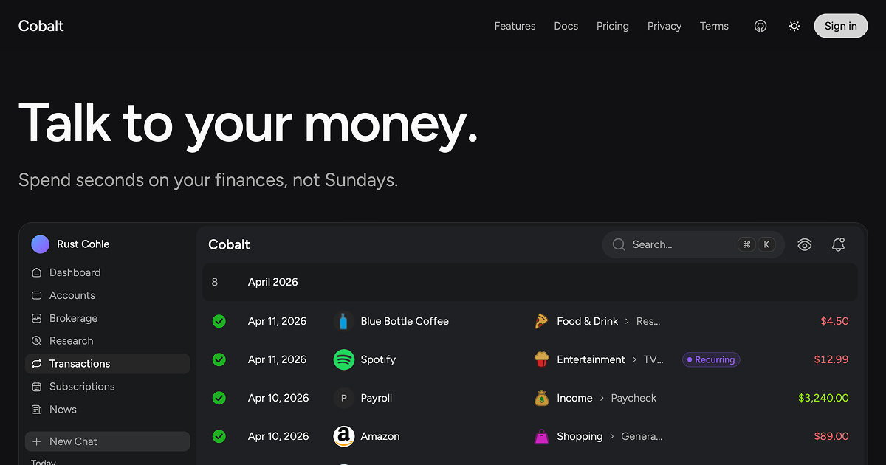

# Cobalt



**Open-source AI personal finance management.**

→ [**cobaltpf.com**](https://cobaltpf.com) — hosted product.

Cobalt lets users connect their financial accounts — manually or through
third-party providers (Plaid, SnapTrade) — to analyze, budget, and track
their finances. AI in the Cobalt platform is used strictly for analysis
and accounting. **Money transfers and spending are not possible.**

## Privacy

AI usage inside the Cobalt platform runs with **zero data retention**
via [Vercel AI Gateway](https://vercel.com/docs/ai-gateway/privacy).
Prompts and completions are not stored or used for training.

Using Cobalt from **third-party services via MCP or external
connectors** is at user discretion — data sent through those tools may
be retained or used for training by the third party. Treat any MCP
client outside Cobalt as untrusted with respect to data retention.

## Source-available for transparency

This repository is published under [AGPL-3.0](./LICENSE) so users,
security researchers, and the broader community can audit exactly how
Cobalt handles financial data. **Self-hosting is not officially
supported.** The hosted product is the canonical way to use Cobalt.
Issues requesting setup help for self-hosted deployments will be
closed — see [`docs/oss/SCOPE.md`](./docs/oss/SCOPE.md).

See [`RELICENSING.md`](./RELICENSING.md) for contribution and copyright
terms (DCO sign-off required) and [`SECURITY.md`](./SECURITY.md) for
vulnerability disclosure.

## Disclaimer

Cobalt is **not financial, investment, tax, or legal advice**. The
software is provided "as is", without warranty of any kind. The hosted
product is the only supported deployment. Running this code yourself is
unsupported and at your own risk.

---

## Development

This project uses [Better-T-Stack](https://github.com/AmanVarshney01/create-better-t-stack) — TypeScript monorepo with React, TanStack Start, Hono, Bun, Drizzle, and Postgres.

## Features

- **TypeScript** - For type safety and improved developer experience
- **TanStack Start** - SSR framework with TanStack Router
- **TailwindCSS** - Utility-first CSS for rapid UI development
- **Shared UI package** - shadcn/ui primitives live in `packages/ui`
- **Hono** - Lightweight, performant server framework
- **Bun** - Runtime environment
- **Drizzle** - TypeScript-first ORM
- **PostgreSQL** - Database engine
- **Authentication** - Better-Auth
- **Turborepo** - Optimized monorepo build system

## Getting Started

First, install the dependencies:

```bash
bun install
```

## Database Setup

This project uses PostgreSQL with Drizzle ORM.

1. Make sure you have a PostgreSQL database set up.
2. Update your `apps/server/.env` file with your PostgreSQL connection details and **Better Auth** settings:
   - `BETTER_AUTH_SECRET` (≥32 chars), `BETTER_AUTH_URL` (e.g. `http://localhost:3000`), `CORS_ORIGIN` (e.g. `http://localhost:3001`)
   - **Google:** `GOOGLE_CLIENT_ID`, `GOOGLE_CLIENT_SECRET`, `GOOGLE_IOS_CLIENT_ID` (native iOS client id for the extra `google_ios` provider)
   - **Apple:** `APPLE_TEAM_ID`, `APPLE_KEY_ID`, `APPLE_SERVICE_ID`, `APPLE_APP_BUNDLE_IDENTIFIER`, `APPLE_PRIVATE_KEY` (PEM for Sign in with Apple)
   - Optional: `TRUSTED_ORIGINS_EXTRA` — comma-separated origins to add to Better Auth’s `trustedOrigins` (staging URLs, etc.)

   Email/password is **disabled**; sign-in is **Google and Apple only** (same idea as `horizon-test`).

3. Apply the schema to your database:

```bash
bun run db:push
```

Then, run the development server:

```bash
bun run dev
```

### Production-like local preview (like `next build` + `next start`)

This repo splits the **SPA** (Vite), **API** (Hono), and **zero-cache**, so one command can’t mirror Next.js exactly — but from the repo root:

```bash
bun run build   # compile web + server + fumadocs
bun run start   # API + web preview + zero-cache + fumadocs (after build)
```

The main web **`vite preview`** uses port **3001** (same as `vite dev`). **Fumadocs** uses **`vite preview`** on port **4000**. Ensure **`CORS_ORIGIN`** / Better Auth allow **`http://localhost:3001`** for the web app.

`bun run start` runs **web**, **server**, **zero-cache**, and **fumadocs** via **`turbo run start`** — same **Turbo TUI** as `build` / `dev` (arrow keys to switch task logs). Run **`bun run build`** first.

**Zero cache env:** copy `apps/zero-cache/.env.example` to `apps/zero-cache/.env` and set `ZERO_UPSTREAM_DB`, plus `ZERO_QUERY_URL` / `ZERO_MUTATE_URL` pointing at this repo’s API. Enable **`ZERO_QUERY_FORWARD_COOKIES=true`** and **`ZERO_MUTATE_FORWARD_COOKIES=true`** so session cookies reach `/api/zero/query` — otherwise `getSession` sees no user and Zero queries return empty rows. The `zero-cache` app loads **only** `apps/zero-cache/.env` via `dotenv-cli` — production sets the same variables on the host instead of a file.

**Roles (this project):** `DATABASE_URL` in `apps/server/.env` uses the **application** Postgres user (regular privileges) and is also what server-side Zero mutates use. `ZERO_UPSTREAM_DB` in `apps/zero-cache/.env` uses the host’s **default / Zero upstream** role (per provider setup) for replication. They can point at the same cluster and database with **different users**.

**Postgres connection limits:** SQLSTATE `53300` (_remaining connection slots are reserved for roles with the SUPERUSER attribute_) usually means **non-superuser** slots are exhausted; the app role behind `DATABASE_URL` hits that limit before elevated roles. `bun dev` runs the API (Drizzle pool + Zero mutate pool on `DATABASE_URL`), **zero-cache**, and replication. Mitigations: use a **pooled** URL for the **application** role (e.g. Neon “Pooled”, Supabase `:6543`), lower `DATABASE_POOL_MAX` / `ZERO_DB_POOL_MAX`, stop duplicate dev processes, or raise `max_connections` / plan limits.

Open [http://localhost:3001](http://localhost:3001) in your browser to see the web application.
The API is running at [http://localhost:3000](http://localhost:3000).

## UI Customization

React web apps in this stack share shadcn/ui primitives through `packages/ui`.

- Change design tokens and global styles in `packages/ui/src/styles/globals.css`
- Update shared primitives in `packages/ui/src/components/*`
- Adjust shadcn aliases or style config in `packages/ui/components.json` and `apps/web/components.json`

### Add more shared components

Run this from the project root to add more primitives to the shared UI package:

```bash
npx shadcn@latest add accordion dialog popover sheet table -c packages/ui
```

Import shared components like this:

```tsx
import { Button } from "@cobalt-web/ui/components/button";
```

### Add app-specific blocks

If you want to add app-specific blocks instead of shared primitives, run the shadcn CLI from `apps/web`.

## Project Structure

```
cobalt-web/
├── apps/
│   ├── web/         # Frontend application (React + TanStack Start)
│   └── server/      # Backend API (Hono)
├── packages/
│   ├── ui/          # Shared shadcn/ui components and styles
│   ├── auth/        # Authentication configuration & logic
│   └── db/          # Database schema & queries
```

## Available Scripts

- `bun run dev`: Start all applications in development mode
- `bun run build`: Build all applications
- `bun run dev:web`: Start only the web application
- `bun run dev:server`: Start only the server
- `bun run check-types`: Check TypeScript types across all apps
- `bun run db:push`: Push schema changes to database
- `bun run db:generate`: Generate database client/types
- `bun run db:migrate`: Run database migrations
- `bun run db:studio`: Open database studio UI
